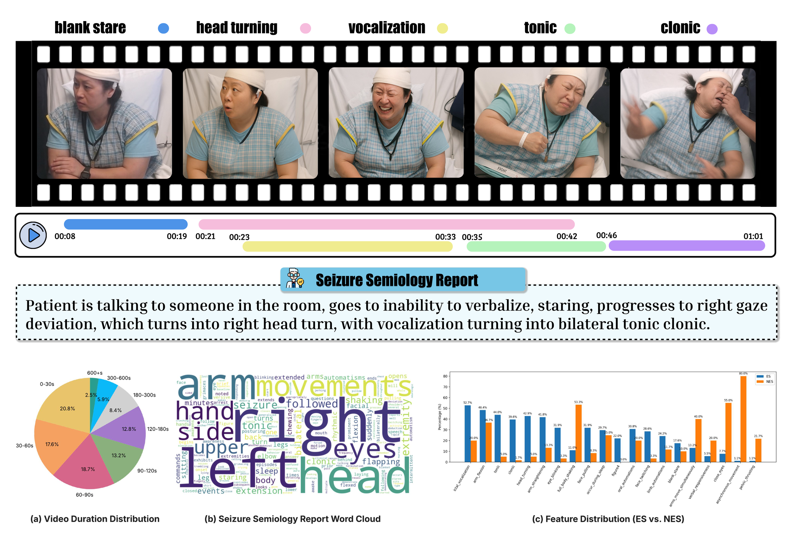
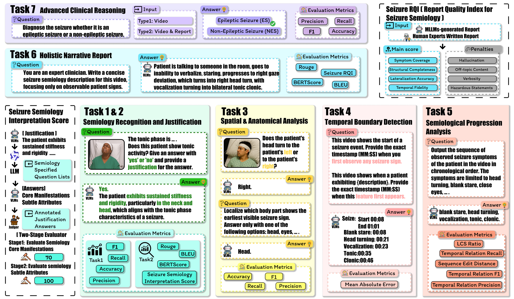
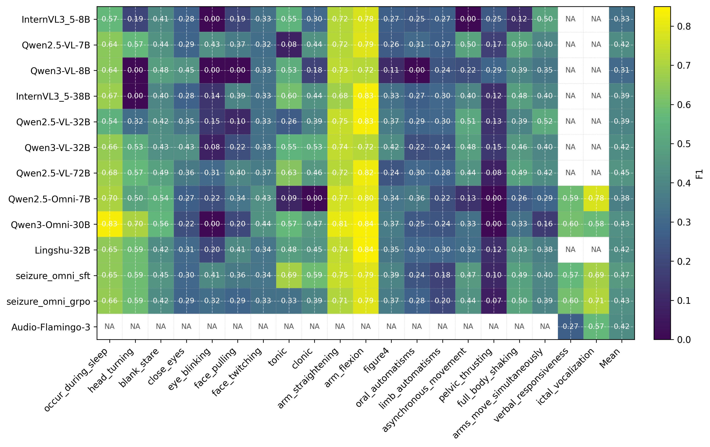
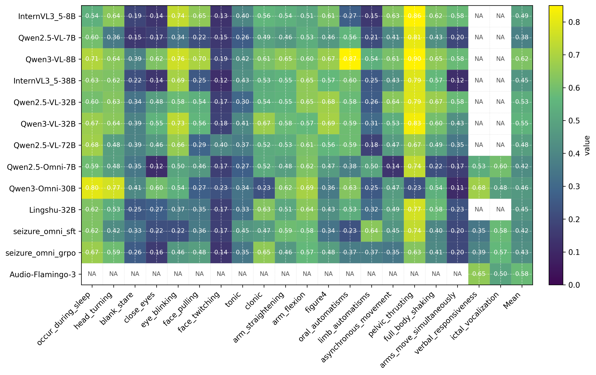
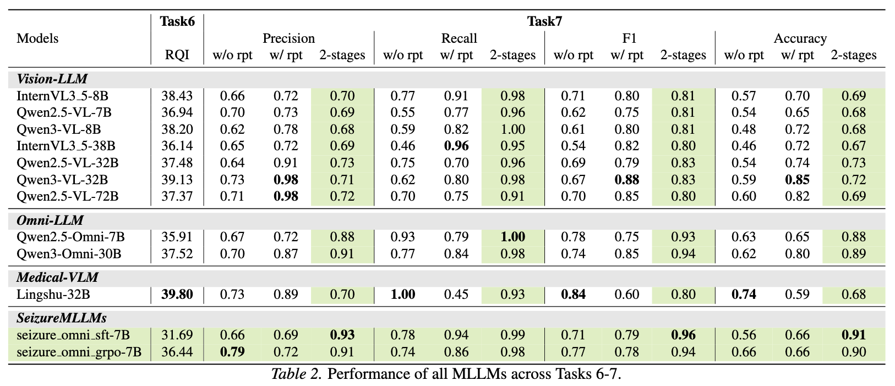

# Seizure-Semiology-Suite (S³) --- ICML 2026 Spotlight.

**A Clinically Multimodal Dataset, Benchmark, and Models for Seizure Semiology Understanding**

---

## Overview

**S³ comprises three components:**

- **Seizure-Semiology-Dataset**: 438 de-identified seizure videos from 116 adult patients, annotated with over 35,000 dense labels covering 20 ILAE-defined semiological features.
- **Seizure-Semiology-Bench**: A seven-task hierarchical benchmark progressing from low-level feature perception to clinical report generation and diagnosis.
- **Seizure-Semiology-Models**: Seizure-specialized fine-tuned models (SFT and GRPO) and a two-stage neuro-symbolic classification framework achieving F1 = 0.96 on epileptic vs. non-epileptic seizure (ES/NES) classification.




---

## Dataset

438 seizure videos from 116 adult patients (ages 18–64), collected in a tertiary Epilepsy Monitoring Unit (2019–2023) under IRB approval and full de-identification.

| Property | Value |
|---|---|
| Total videos | 438 (300 ES / 138 NES) |
| Patients | 116 (84 ES / 32 NES, ages 18–64) |
| Total annotation labels | >35,000 |
| Annotated features | 20 ILAE-defined semiological features |
| Resolutions | 1920×1080 (81%), 1280×720 (18%), 640×480 (1%) |

**20 semiological features:** Blank stare, lip smacking, versive head turn, unilateral arm movement, bilateral tonic-clonic, automatisms, eye deviation, facial pulling, dystonic posturing, figure-four sign, ictal cry, oral automatisms, manual automatisms, leg automatisms, consciousness alteration, postictal confusion, postictal amnesia, respiratory changes, vocalization, asymmetric movements.

Each feature is annotated with **presence/absence**, **temporal boundaries** (MM:SS), and **free-text justification**.

## Benchmark: Seven-Task Hierarchy




---

## Baseline Models & Results

11 open-weight MLLMs benchmarked across all tasks:

| Category | Models |
|---|---|
| General VLMs (small) | InternVL3.5-8B, Qwen2.5-VL-7B, Qwen3-VL-8B |
| General VLMs (medium) | InternVL3.5-38B, Qwen2.5-VL-32B, Qwen3-VL-32B |
| General VLMs (large) | Qwen2.5-VL-72B |
| Audio & Omni-modal | Audio-Flamingo-3, Qwen2.5-Omni-7B, Qwen3-Omni-30B |
| Medical VLM | Lingshu-32B |
| Seizure-specialized | seizure-omni-sft-7B, seizure-omni-grpo-7B |

### Tasks 1 & 2 — Feature Recognition and Justification



*Task 1: F1 scores per model × semiological feature. Models excel at prominent sustained features (tonic, clonic) but struggle with subtle or fast-evolving signs (oral automatisms, face twitching). Scaling from 7B to 72B yields minimal gain (~0.42–0.45 mean F1).*



*Task 2: Seizure Semiology Interpretation Scores per model × feature. Performance is highest for unambiguous motor behaviors and drops for questions requiring temporal reasoning or subtle motion detection.*

### Tasks 3–5 — Spatial, Temporal, and Sequence Understanding


All models score F1 < 0.2 on spatial laterality (Task 3), exposing a fundamental failure mode. Temporal boundary detection (Task 4) best performer is Qwen2.5-VL-32B (onset MAE 8.19 s). Sequence analysis (Task 5) remains challenging across all models.

### Tasks 6–7 — Report Generation and Clinical Diagnosis



Lingshu-32B achieves the highest RQI (39.80) among baselines. For Task 7, the two-stage classification + seizure-omni-sft achieves **F1 = 0.96**, a +0.16 improvement over direct MLLM classification.

---

## Improvement Strategies

### Seizure-Specialized Fine-tuning

Base model: **Qwen2.5-Omni-7B** (joint audio-visual processing).

**SFT** — supervised fine-tuning on video–prompt–answer triplets:
```bash
cd finetune/sft
bash qwen2_5_omni_task_1_7_sft.sh
# or with custom loss:
bash qwen2_5_omni_task_1_7_sft_custom_loss.sh
```

**GRPO** — reinforcement learning with task-specific reward functions:
- Tasks 1, 3, 7: accuracy-based reward
- Tasks 2, 6: composite BLEU + ROUGE reward
- Task 4: temporal proximity reward
- Task 5: LCS ratio reward

```bash
cd finetune/rlhf
bash qwen2_5_omni_task_1_7_grpo.sh
```

### Two-Stage Seizure Classification

Decouples visual perception from diagnostic reasoning:

1. **Stage 1 (Perception):** MLLM runs Task 1 → binary feature vector v ∈ {0,1}²⁰ for the 20 semiological features.
2. **Stage 2 (Classification):** Random Forest classifier maps the feature vector to ES/NES diagnosis.

This neuro-symbolic approach delivers +0.16 F1 over direct MLLM classification and +0.07 over report-augmented classification.

---

## Repository Structure

```
SeizureSemiologyBench/
├── inference/              # Model inference scripts (task × model)
│   ├── task12_*.py         # Tasks 1 & 2 (audio/omni models)
│   └── task34567_*.py      # Tasks 3–7 (VLMs)
├── evaluation/             # Per-task evaluation scripts
│   ├── Task1_PrecissionRecallF1Accuracy.py
│   ├── Task2_blue_rouge_bertscore_metrics.py
│   ├── Task3_PrecissionRecallF1Accuracy.py
│   ├── Task4_time_mae.py
│   ├── task5_compute_sequence_metrics.py
│   ├── seizure_rqi_evaluation.py   # Task 6 Seizure-RQI (LLM-as-judge)
│   └── Task7_*.py
├── finetune/
│   ├── sft/                # SFT training scripts
│   ├── rlhf/               # GRPO scripts and reward functions
│   ├── dataset/            # Fine-tuning dataset preparation
│   └── raw2ft/             # Raw-to-fine-tuning data conversion
├── result/
│   ├── ground_truth/       # Ground truth CSVs for all tasks
│   └── vlm_inference/      # Model inference outputs
├── assets/                 # Figures for this README
├── metrics/                # Aggregated evaluation metric CSVs
├── inference_result/       # Per-model, per-chunk inference outputs
├── data_processing/        # Dataset alignment and annotation QC
├── installation/           # Environment setup guides per model
└── test_dataset/           # Test split data and evaluation scripts
```

---

## Installation

| Model family | Guide |
|---|---|
| Qwen2.5-VL | [qwen25vl_installation.md](installation/qwen25vl_installation.md) |
| Qwen3-VL (MoE/Dense) | [qwen3vl_moe_installation.md](installation/qwen3vl_moe_installation.md) |
| Qwen2.5-Omni / Qwen3-Omni | [qwen25omni_installation.md](installation/qwen25omni_installation.md) / [qwen3omni_installation.md](installation/qwen3omni_installation.md) |
| InternVL3.5 | [internvl_installation.md](installation/internvl_installation.md) |
| Audio-Flamingo-3 | [audio_flamingo3_installation.md](installation/audio_flamingo3_installation.md) |
| Lingshu-32B | [lingshu_installation.md](installation/lingshu_installation.md) |
| Fine-tuning (SFT/GRPO) | [finetune_installation.md](installation/finetune_installation.md) |
| Evaluation metrics | [metrics_task_1_4_installation.md](installation/metrics_task_1_4_installation.md) |

---

## Running Inference

Scripts follow the naming convention `task{N}_{ModelName}.py` and accept arguments for GPU, model path, dataset dir, output dir, and video range.

**Tasks 3–7 with Qwen3-VL-32B:**
```bash
python inference/task34567_Qwen3VL_dense_lina.py \
    --gpu 0,1 \
    --model_name Qwen/Qwen3-VL-32B-Instruct \
    --dataset_dir /path/to/seizure/videos \
    --output_dir ./inference_result \
    --videos_range 1-438
```

**Tasks 1–2 with Qwen3-Omni-30B:**
```bash
python inference/task12_qwen_3_omni_30b.py \
    --gpu 0,1,2,3 \
    --model_name Qwen/Qwen3-Omni-30B-A3B-Instruct \
    --dataset_dir /path/to/seizure/videos \
    --output_dir ./inference_result \
    --videos_range 1-438
```

### Video Processing Strategy

| Tasks | Strategy | FPS | Window |
|---|---|---|---|
| 1, 2, 5, 6 | Uniform sliding window (30 s, 5 s overlap) | 2 FPS | 30 s (60 s for Qwen3) |
| 3 | Event-centric clipping (lateralizing segments) | 1 FPS (2 for Qwen3) | — |
| 4 | 60 s clip centered on symptom onset | 1 FPS (2 for Qwen3) | — |
| 7 | Uniform sparse sampling (entire video) | — | 60 frames (120 for Qwen3) |

---

## Running Evaluation

Ground truth CSVs are in [result/ground_truth/](result/ground_truth/). Scripts read model outputs from [result/vlm_inference/](result/vlm_inference/) and write metric CSVs to [metrics/](metrics/).

```bash
# Task 1
python evaluation/Task1_PrecissionRecallF1Accuracy.py

# Task 4
python evaluation/Task4_time_mae.py

# Task 6 — requires OpenAI API key
export OPENAI_API_KEY=your_key
python evaluation/seizure_rqi_evaluation.py \
    --model_name Qwen3-VL-32B-Instruct \
    --output_dir ./result/vlm_inference
```

---

## Data Access

Seizure videos are available under a **Data Use Agreement**. Annotation CSVs, evaluation code, baseline scores, and fine-tuned model weights will be released via Hugging Face upon publication.

To request dataset access, please visit the project website (link provided upon publication).


---

## Citation

```bibtex
@inproceedings{s3_seizure_semiology_2026,
  title     = {Seizure-Semiology-Suite (S3): A Clinically Multimodal Dataset, Benchmark, and Models for Seizure Semiology Understanding},
  author    = {Anonymous Authors},
  booktitle = {International Conference on Machine Learning (ICML)},
  year      = {2026},
  note      = {Under review}
}
```
